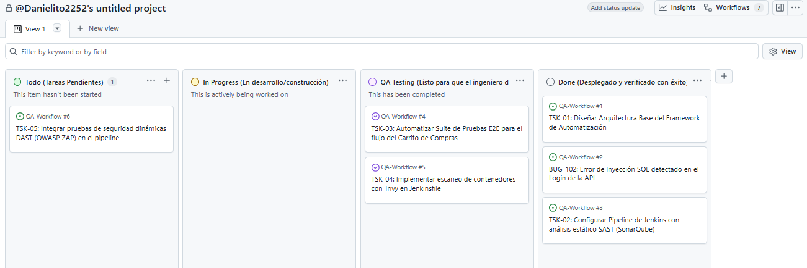

# 🛠️ Agile QA Management Hub

<div align="center">


### 📋 Centro de Gestión de Calidad, Trazabilidad y Metodologías Ágiles

Repositorio diseñado para centralizar la planificación de pruebas, control de calidad, gestión de requerimientos y seguimiento de historias de usuario dentro de un ecosistema DevOps moderno.

</div>

---

## 🚀 Descripción

Este repositorio funciona como el punto central de gestión de calidad del proyecto, permitiendo mantener la trazabilidad entre requerimientos, documentación, pruebas y automatizaciones.

Su objetivo es garantizar que cada requerimiento tenga una estrategia de validación claramente definida y alineada con los procesos Agile y DevOps.

---

## 📂 Estructura del Repositorio

| Carpeta / Archivo                | Descripción                                                                 |
| -------------------------------- | --------------------------------------------------------------------------- |
| 📁 `.github/ISSUE_TEMPLATE`      | Plantillas para reportar defectos y documentar casos de prueba desde GitHub |
| 📁 `docs/`                       | Documentación principal del proyecto                                        |
| 📄 `docs/Matrix-Trazabilidad.md` | Relación entre requerimientos y pruebas automatizadas                       |
| 📄 `docs/Test-Plan.md`           | Plan maestro de pruebas                                                     |
| 📁 `templates/`                  | Plantillas reutilizables para QA                                            |
| 🖼️ `tablero-kanban.png`         | Flujo visual de gestión Agile y control de calidad                          |
| 📄 `LICENSE`                     | Licencia del proyecto                                                       |

---

## 🔄 Flujo de Gestión de Calidad

El siguiente tablero representa el ciclo de vida de historias de usuario, tareas y defectos dentro del proyecto.

<p align="center">
  
</p>

---

## 🔗 Ecosistema del Proyecto

Este repositorio forma parte de una solución integral de calidad y automatización:

```text
Requerimientos
       │
       ▼
Agile QA Management
       │
       ▼
Automatización Cypress
       │
       ▼
Pipeline Jenkins + DevSecOps
       │
       ▼
Reportes y Evidencias
```

### 🧪 Automatización de Pruebas

Los casos de prueba definidos en este repositorio son automatizados mediante:

➡️ https://github.com/Danielito2252/cypress-e2e-suite

### ⚙️ Integración Continua y DevSecOps

La ejecución automatizada, generación de reportes y validaciones se realizan mediante:

➡️ https://github.com/Danielito2252/Jenkins-Devsecops-Pipeline

---

## 🎯 Objetivos

* Mantener trazabilidad entre requerimientos y pruebas.
* Estandarizar procesos de aseguramiento de calidad.
* Facilitar auditorías y revisiones de proyecto.
* Centralizar la documentación Agile.
* Integrar QA dentro del ciclo DevOps.

---

## 🛠️ Herramientas y Metodologías

| Categoría            | Tecnologías                   |
| -------------------- | ----------------------------- |
| Gestión Agile        | Scrum · Kanban                |
| QA                   | Test Cases · Bug Tracking     |
| Automatización       | Cypress                       |
| CI/CD                | Jenkins                       |
| Control de Versiones | Git · GitHub                  |
| DevSecOps            | Security Scanning · Reporting |

---

## 👨‍💻 Autor

### Herberth Barrios

🔗 **LinkedIn**
https://www.linkedin.com/in/herberth-barrios-299236261/

🔗 **GitHub**
https://github.com/Danielito2252

---

## 📄 Licencia

Este proyecto está distribuido bajo la licencia **MIT**.

Desarrollado como parte de una iniciativa para fortalecer la gestión de calidad, trazabilidad y automatización dentro de entornos Agile y DevOps.
